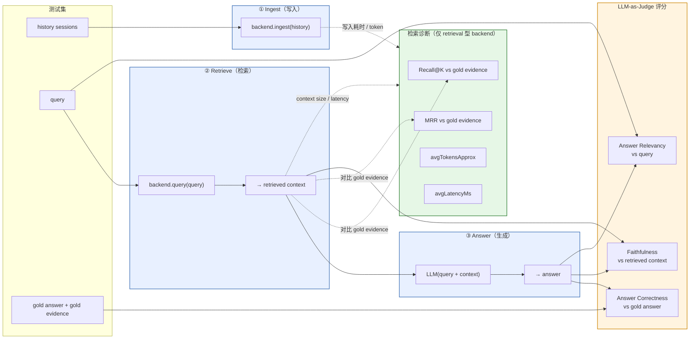

# Agent Memory 调研与评测

> - 作者：maddox
> - 状态：草稿 · 持续完善中
> - 日期：2026-05-13
> - 原文链接：https://moxt.ai/w/6zrnmb90/d3b3bf4e-0d61-431d-b62a-437d4bf90854

---

## 一、为什么做这件事

### 1.1 问题背景

LLM agent 在多 session 场景下会失忆：上下文窗口装不下、跨会话信息丢失、用户偏好难以保持。市面上把这件事统称为 "agent memory" 问题，于是大量精力被投入到"怎么把记忆存好"——分块、抽取、压缩、知识图谱、向量库选型。

### 1.2 关于问题的思考：这不止是"长期记忆库"问题，而是"个性化检索 + 上下文工程"问题

调研做完之后，我们的判断是：**"agent memory" 这个命名把问题指向了错误的重心。** 真正决定效果的不是"记忆怎么存"，而是"在回答某个具体问题时，是否能把对的内容、以对的形式、以对的顺序送进 LLM"。

支持这个判断的证据分两层，要分开看，不能混：

* **流派之间**：LoCoMo 横评里 Verbatim 派（MemMachine 0.9169）显著高于 Fact Extraction 派（Mem0 ~0.68）——**抽取确实会丢细节**，存储流派选错了，下游怎么优化都补不回来。

* **流派之内**：在已选 ground-truth preserving 存储的前提下，MemMachine 在 LongMemEvalS 的六维消融显示，retrieval/answering 端 5 项可叠加优化合计 +11.0%，ingestion 端唯一可调的 chunk 粒度仅 +0.8%——**存储不丢之后，再继续抠存储端 ROI 很低，杠杆在检索和上下文工程**。

这两层对应到自家产品也一致：先确保该记的没被抽掉，再把功夫花在"该用的时候取得准、拼得对"。badcase 也几乎都集中在后者——该记的没在该用的时候被取出来 / 被淹没在噪声里 / 被错误地拼进 prompt。

### 1.3 重新框定后，我们要回答的三个问题

按"个性化检索 + 上下文工程"重新框定后，分享的核心问题收敛为：

1. **怎么衡量"取得准、用得好"** —— 评测体系应该围绕 retrieval / context 维度建，而不是围绕"记忆库存了多少"。
2. **哪些工程动作 ROI 最高** —— 在我们的产品场景下，复刻一遍 MemMachine 的消融，看哪几项是真正有效的杠杆。
3. **Moxt 自家路线现在到底在什么位置** —— 把 Moxt STM roster + Hybrid RAG 放进同一套评测里，对照（a）"裸 LLM 长上下文全塞" 这个上限锚点 和（b）开源 SOTA（mem0 / mempalace / graphiti / letta 等六大流派代表），看清楚我们离上限有多远、相对开源系统是领先还是落后，进而决定哪条路线该升级、哪条该保留。

> 后文的评测系统、评测结论、对产品的启发，都围绕这三个问题展开。

---

## 二、Agent Memory 领域调研

> 本节流派划分主要参考 [acmerfight 的 AI Memory 系统架构调研](https://gist.github.com/acmerfight/1a4889eae1b19aa7f1ac2e9c4ff3e668)（2026），并结合本目录下既有调研材料（AI-Memory-Systems-Research-Report、ai-memory-comparison、Memory-Tech-Decisions、CC-vs-Openclaw 等）做交叉印证。

### 2.1 六大流派对比

> 各家最新源码或论文实测。"更新 LLM" 列单独刻画**冲突检测 / 合并 / 去重路径**的 LLM 次数（不含初始抽取与读取）。

| 流派 | 代表 | 存储介质 | 写入 LLM | 更新模式（细节） | 更新 LLM | 检索方式 | 读取 LLM |
| --- | --- | --- | --- | --- | --- | --- | --- |
| **A 事实抽取** | Mem0（2026 ADD-only） | 向量 DB + SQLite + 实体集合 | **1** | system prompt 写死 `"sole operation is ADD"`；MD5 hash 去重 + 实体语义链接，无冲突检测 | 0 | spaCy 实体 + 向量 + BM25 + 实体 boost | 0 |
| **B 逐字存储** | MemPalace | ChromaDB + SQLite KG | **0** | KG 时间窗口纯规则（`mempalace_kg_invalidate`） | 0 | 向量 + BM25 + 时间 boost | 0（可选 1） |
| **B' 半逐字** | MemMachine | Neo4j + Postgres+pgvector | 1–4 | `llm_feature_update` 让 LLM 输出 ADD/UPDATE/DELETE 命令；超 20 features 触发 `llm_consolidate_features` | 1（+ 周期 1） | 向量 + 邻域扩展 + 可选 reranker | 0–3 + 1 答题 |
| **C 时序图谱** | Zep / Graphiti | Neo4j + Postgres | 1+ | `resolve_edge_contradictions` 让 LLM 把候选老边分 duplicate / contradicted；老边设 `invalid_at` | 1 / 边 | 图遍历 + 向量混合 | 0 |
| **D 自管理** | Letta / MemGPT | Postgres 三层 | 1（主 turn） | `core_memory_replace` / `memory_apply_patch` 纯字符串操作；合并由 Agent 主 turn 自己决定 | 0 | tool call → Turbopuffer 混合 | 1 |
| **E 分层巩固** | EverMemOS / AriadneMem | Mongo+ES+Milvus / Qdrant | 1–2 | 在线聚类增量更新 scene 摘要；AriadneMem 用 conflict-aware coarsening 合并重复并保留状态变化为时间边 | 1（周期 consolidation） | scene-guided 重构召回 / Steiner Tree | 0–3 |
| **F KV 缓存** | MemArt | tensor blob 磁盘 | 1 forward | 推测 append-only / 带版本号 | 未明确 | latent space attention | 0 |

> **反直觉点**：直觉上"事实抽取流"应该最依赖 LLM 做 update 决策（Mem0 旧版 2025 确实是这么做的，prompt 还留在 `mem0/configs/prompts.py:176-443` 但已不被调用）。**新版（2026 ADD-only）反而砍掉了**——靠 hash + 实体链接代替 LLM 冲突判断。**真正在更新路径用 LLM 的是 Graphiti（每边 1 次）和 MemMachine（每写 1 次 + 周期 consolidation 1 次）。** 这也是为什么 Graphiti / MemMachine 自报的 token 成本结构和 Mem0 完全不一样。

#### 各流派最显著优缺点

| 流派 | 优点 | 缺点 |
| --- | --- | --- |
| **A 事实抽取**（Mem0） | 写入便宜 + 检索 0 LLM，单位成本最低 | ADD-only 无冲突检测，用户改口后旧 fact 永远共存 |
| **B 逐字存储**（MemPalace / MemMachine） | 0 LLM 写入 + 留原文证据，召回上限高 | append-only 永不收敛，存储和召回噪声随时间无限膨胀 |
| **C 时序图谱**（Zep / Graphiti） | bi-temporal 主动管理冲突，多跳和时间敏感问题最强 | 每条边 1+ 次 LLM，写入是六派里最贵 |
| **D 自管理**（Letta / MemGPT） | 由 Agent 自己决定写啥和查啥，天然适配 long-running agent | 全靠主 LLM 自觉，模型偷懒就不写、查的时候受模型干扰也大 |
| **E 分层巩固**（EverMemOS / AriadneMem） | 模拟人脑短-长期记忆曲线，理论最完整 | 工程成熟度低、阈值参数多，reconstructive 触发时 P99 抖动大 |
| **F KV 缓存原生**（MemArt） | 写入 0 额外 LLM、prefill 省 91–135×，理论上限最高 | 无更新机制 + 绑死特定模型，目前只能跑研究 demo |

> **横向规律**：写入越便宜（B、F）更新就越欠债，更新越严谨（C）写入就越贵，自管理（D）把成本压到主 LLM 上——**没有"写入便宜 + 更新严谨 + 检索 0 LLM"三全的方案**。

### 2.2 主要 benchmark 上的代表数据（横向参考）

> ⚠️ 这些数字来自各项目自报或独立复现，口径不完全一致，仅作流派量级对比。

**LongMemEval（500 题，偏检索）：**

* MemPalace（raw）：96.6%
* OMEGA：95.4%
* Mem0（2026 新算法）：93.4%
* MemMachine：93.0%
* Zep：63.8%

**LoCoMo（多跳推理）：**

* EverOS：~93%
* HyperMem：92.73%
* Mem0（2026 新算法）：91.6%
* MemMachine：91.69%
* Letta / MemGPT：~83.2%

### 2.3 几条有信源支撑的行业观察

读完所有材料后，**有公开证据支撑**的行业级观察主要有三条：

1. **多跳 / 时序场景，图 + 时序结构显著优于纯向量** —— 独立 LongMemEval 评测里 Zep（temporal KG）63.8% vs Mem0（vector-first）49.0%（[vectorize.io 横评](https://vectorize.io/articles/mem0-vs-zep)、[aicoolies 横评](https://aicoolies.com/comparisons/mem0-vs-zep)）。但**仅限于多跳与时序问题**——简单语义召回、偏好类问题上 vector-first 仍然够用，Mem0 也已开始往里加 Graph Memory 层。所以更准确的表述不是"图赢了架构辩论"，而是"按问题类型选架构"。
2. **同一存储流派内部，retrieval / answering 端的杠杆远大于 ingestion 端** —— MemMachine 在 LongMemEvalS 上的六维消融（§1.2 已展开）：在已选 ground-truth preserving 存储的前提下，retrieval 端 5 项叠加 +11%，ingestion 端唯一可调的 sentence chunking 仅 +0.8%。**前提条件很重要**：跨流派来看（LoCoMo 上 Mem0 ~0.68 vs MemMachine 0.9169），存储是否丢信息仍然是大头。
3. **用 RL 学"什么该记 / 什么时候取"开始出现** —— Memex(RL)（[Accenture, arXiv:2603.04257](https://arxiv.org/abs/2603.04257)）把 compress / read 当作 RL 动作空间里的工具调用，用 GRPO + 上下文溢出 / 冗余惩罚训出读写策略；同方向还有 MEM1（[arXiv:2506.15841](https://arxiv.org/abs/2506.15841)）。目前都还是研究阶段成果，不是主流工程实践。

> 原稿里另外两条——"图赢了架构辩论"、"写入零 LLM 成本成为竞争维度"——前者表述过强，后者没有可引用的横评 / 行业报告做支撑，已删掉。

---

## 三、Memory 评测系统的搭建

### 3.1 设计目标

**核心定位：做一套客观的 memory 评测系统。** "客观"具体落到两条硬要求 + 三组工程属性。

**两条硬要求**

* **真实接入**：所有 backend 都跑真实 SDK / 服务（Mem0 真实写入 Qdrant，Letta 起本地 server，Cognee 跑本地图库），不用 mock。结果就是端到端真实路径上的表现，不是 paper 数字。

* **可扩展**：新加一个 backend 只需实现 `ingest / query / dispose` 三个接口；新加一个 metric 只需注册到 judge pipeline，不动主框架。

**三组工程目标**

目前工程实现还比较粗糙，但围绕三个目标在迭代：

* **高效**：LLM / embedding 走磁盘缓存，重复跑不重复花钱；并发与预置脚本免敲长命令。

* **稳定**：超时与失败隔离不中断整轮；本地代理避免远程不稳定；不能并发的 backend 强制串行。

* **可重跑 + 可观测**：每次跑落到不可变 `runs/<timestamp>/`，可一键导出到 Promptfoo GUI 做筛选 / 跨 run diff / fail case 溯源。

### 3.2 评测主流程

每个 case 都走 **Ingest → Retrieve → Answer** 三段式管线，每一段单独评一组指标。这张图是后面所有内容的脚手架——指标在哪一阶段被采、谁评谁、gold evidence/answer 怎么流——一图说清。



### 3.3 评测维度与指标

方法论借鉴 MemMachine、RAGAS、DeepEval 三家（详细 metric 列表与背景见各自源链接），这里只讲落地后的体系。

#### 3.3.1 我们的指标

| # | 指标 | 角色 | 取值（0 / 0.5 / 1） | 汇总字段 |
| - | --- | --- | --- | --- |
| 1 | **Answer Correctness** | 主指标 | 1 = 正确 / 0.5 = 部分正确 / 0 = 错误 | `avgAnswerScore`、`answerAccuracy` |
| 2 | **Faithfulness** | 防幻觉 | 1 = faithful / 0.5 = partially / 0 = unfaithful | `avgFaithfulness` |
| 3 | **Answer Relevancy** | 辅助 | 1 = relevant / 0.5 = partially / 0 = irrelevant | `avgAnswerRelevancy` |
| 4 | **Retrieval Diagnostic** | 诊断（仅 retrieval 型 backend） | Recall@K、MRR、avgTokensApprox、avgLatencyMs | — |

> 三档分（1 / 0.5 / 0）借鉴 RAGAS / DeepEval 的标准做法，规避 LLM judge 在二值判断上的方差爆炸。

##### 2）pass / fail 判定（Promptfoo 主榜口径）

```text
pass = (Answer Correctness ≥ 0.5)  AND  (Faithfulness ≥ 0.5)
warn = (Answer Relevancy < 0.5)        ← 软警告，不影响 pass，用于人工复核
```

设计要点：

* **不用单值平均做门槛**——把"答对了"和"没胡编"分开各自卡 0.5，避免一个高一个低互相掩盖。这正是 §3.2 一节里反复强调的"Precision/Recall 拆开报、不用 F1 做金标"的同构思路。

* **Answer Relevancy 仅作软警告**——防止"跑题答案蒙中关键词被打 0.5 partial correctness"的 corner case，但不让它干预主榜结果。

##### 3）按 backend 类型区分诊断指标

`Retrieval Diagnostic`（Recall@K / MRR）**只对 retrieval-style backend 有意义**。对于 context-style backend，这两栏显式置 null：

| backend 类型 | 代表 | Retrieval Diagnostic |
| --- | --- | --- |
| retrieval | moxt-rag、cognee-rag、mem0-rag 等 | Recall@K + MRR + token + latency 都报 |
| STM-only | moxt-stm-roster | null（无 retrieval 阶段） |
| agentic | letta-agentic-lifecycle | null（Agent 自己决定取啥） |
| graph | zep / graphiti | null（图遍历不适合 R@K） |

> 强行给非 retrieval backend 算 Recall@K 是常见的评测体系翻车点——数字毫无意义还会误导决策。

##### 4）尚未覆盖的两件事

* **Update Correctness**（事实被覆盖 / 删除 / 纠正后是否正确更新）—— 可立刻补：LongMemEval 的 `knowledge-update` 子类有 78 题专门测这个，直接复用即可。

* **Noise Robustness**（memory 库被无关记忆污染后端到端准确率衰减）—— 现有公开 set 都不对口，要做需自建一个"逐步注入 + 退化曲线"形态的 mini-bench，短期暂缓。

### 3.4 数据集与 Case 设计

#### 一个合格的 case 集应该包含什么

评测系统不挑数据集来源，但要求每条 case 都能洗成同一种内部 schema——只有这样下游的 backend 适配 / 评测器才不用 case-by-case 改代码。一条 JSONL = 一个 `BenchmarkCase`：

```ts
BenchmarkCase {
  id: string
  title: string
  conversation: [{ id, role, date, content }]   // 给 backend ingest 的对话原文
  documents:    [{ id, path, title, content }]  // 给 backend ingest 的文档原文
  queries: [{
    id,
    category,            // 问题类型（统一字符串）
    question,
    answer,
    goldEvidenceIds      // 答案应来自哪些原文 ID
  }]
}
```

三个不可省的字段：

* **`conversation`** **/** **`documents`**：backend 要 ingest 的原文。两者可只有其一，但 ID 必须稳定——`goldEvidenceIds` 引的就是这些 ID。

* **`queries[].category`**：问题类型必须显式标注（single-hop / multi-hop / temporal / knowledge-update / adversarial 等），否则跑分时无法做分层抽样和分类目分析，整体均值会被某一类样本量大头淹没。

* **`queries[].goldEvidenceIds`**：答案证据来自哪几条 turn / document，是评测器算 Recall@K 和 MRR 的唯一依据。没有这个字段就只能评 Answer Correctness，无法诊断检索环节。

> 不同公开 dataset 的字段结构差异巨大（LongMemEval 一题一独立 haystack，LoCoMo 一对话多问题，BEAM 按 token 长度分档），具体洗法见 `memory-bench/src/converters/*.ts`，这里不展开。

#### 公开 benchmark 一图速览

调研了 7 个候选，按是否对口我们的"长对话 conversational memory"主线打标。

| Benchmark | 主要测什么 | 对我们的取舍 |
| --- | --- | --- |
| LongMemEval | 长对话 memory，5 类能力 | ✅ 主战场 |
| LoCoMo | 长对话多跳，4+1 类 | ✅ 交叉验证 |
| **BEAM** | 长对话 memory，**10 类能力 + 4 长度档** | ✅ 后续 |
| **MemoryAgentBench** | 4 能力簇 + **CR 800 题** | ✅ 补 CR 专项 |
| HotPotQA | Wiki 多跳推理 | ⚠️ 仅 retrieval 推理对照 |
| MuSiQue | 严格多跳推理 | ⚠️ 仅 retrieval 推理对照 |
| SciFact | 科学 fact 二分类 | ❌ 不适用 |

> 各 benchmark 的字段含义、子集划分、踩坑点等细节略——见 `memory-bench/docs/benchmarks/`。

### 3.5 工程实现要点

---

## 四、实际评测结论与分析

### 4.1 评测对象（参赛 backend）

11 家 backend 分三档：**基线**（锚定上下限）、**Moxt 自家方案**（验证现有路线）、**业界开源系统**（覆盖六大流派）。

#### 基线档（4 家，锚定上下限）

| Backend | 做什么 | 检索方式 | 角色 |
| --- | --- | --- | --- |
| `raw-fulltext` | 原文直接当文本索引 | 本地 BM25 | **lexical 下限**——便宜、稳定，等同 §二 `keyword_raw` |
| `raw-vector-rag` | 原文切 chunk 后 embedding | 向量（Cloudflare bge-m3） | **vector 朴素 RAG** |
| `generic-roster` | 规则把输入整理成主题 roster，整份当 context 喂 LLM | 无（全塞） | **非 Moxt 专用的摘要记忆 baseline**——上限锚点之一 |
| `full_context` | 不检索，把所有 session 全塞 LLM | 零检索 | **绝对上限锚点**——回答"memory 工程比裸 LLM 长上下文强多少"。⚠️ 单题 ~115K token，建议只跑 smoke/balanced |

> **基线的两个核心用途：**
>
> * `raw-fulltext` 是**下限**：所有上 embedding / 上 LLM 抽取的 backend 减去这条线的分差，就是它们复杂工程的净收益。差距 < 5pp 基本说明设计白做。
>
> * `full_context` 是**上限**：所有 backend 减去这条线的分差，就是 memory 工程比"裸 LLM 长上下文"强多少。某个 backend 接近甚至超越它，意味着它**不只是省 token，还真的提升了答题质量**。

#### Moxt 自家方案（2 家，验证现有路线）

| Backend | 做什么 | 对应自家产品的什么 |
| --- | --- | --- |
| `moxt-stm-roster-llm` | LLM 生成 Moxt-style topic roster，整份 roster 回答问题 | **STM 短期记忆**核心思路 |
| `moxt-hybrid-rag` | 切 chunk + BM25 + vector cosine + RRF 融合 | **文件搜索 / RAG** 核心方法 |

> `generic-roster`（基线档）和 `moxt-stm-roster-llm` 形成消融对照：roster 是否走 LLM 生成、贡献多少分。

#### 业界开源系统（6 家，覆盖六大流派）

| Backend | 流派 | 简介 | 备注 |
| --- | --- | --- | --- |
| `mem0-local` | **A 事实抽取** | LiteLLM 抽 facts + bge-m3 embed + Chroma 文件存 | A 流派代表 |
| `memori` | **A 事实抽取**（轻量版） | SQLite 本地存储 + recall | 高级 augmentation 依赖 Memori 官方付费 API，全功能模式跑分会受限 |
| `mempalace` | **B 逐字存储** | Python bridge 调官方 mempalace，本地 palace 写入 + 空间层级过滤 | B 流派代表，零 LLM 写入 |
| `openclaw-files` | **B 逐字存储**（文件系统变种） | 生成 `MEMORY.md` + daily notes，对文件做 keyword/vector/hybrid 检索 | "把记忆写成 Obsidian 风格知识库" |
| `graphiti` | **C 时序知识图谱** | Graphiti + FalkorDB 抽实体关系边 + 边搜索 | C 流派纯 KG 代表 |
| `cognee` | **C 时序图谱**（自动路由变种） | `remember()` 建库 + `recall(auto_route=True)` | 自动路由色彩，介于 C 和 E 之间 |
| `letta-agentic-lifecycle` | **D Agent 自管理** | 每 case 创建本地 Letta agent，时间序喂历史，agent 自己写 archival、自主 search | D 流派唯一代表 |

#### 流派覆盖盘点

| 流派 | 覆盖 | 说明 |
| --- | --- | --- |
| A 事实抽取 | ✅ mem0-local + memori | 重 vs 轻双覆盖 |
| B 逐字存储 | ✅ mempalace + openclaw-files | ChromaDB 路线 vs 文件系统路线 |
| C 时序知识图谱 | ✅ graphiti + cognee | 纯 KG vs 自动路由 |
| D Agent 自管理 | ✅ letta-agentic-lifecycle | 唯一代表 |
| **E 分层巩固** | ❌ 不接 | EverMemOS / HyperMem / AriadneMem 全是学术，无成熟开源工程实现 |
| **F KV 缓存** | ❌ 不接 | MemArt 未开源；且 KV cache 绑定特定模型，根本不适合做长期 memory |

> **结论**：业界落地能用的 4 个流派全覆盖，且 A/B/C 三个主流流派内部都做了双实现对照。E/F 短期没有补的必要——一个工程化不成熟，一个不属于"长期 memory"的解。

### 4.2 核心结论

> 本节并列三批结果：**moxt-memory-v1**（自造小集，验证体系可用性 + 基础能力诊断）、**LongMemEval-S smoke**（公开集，长 session 单题大海捞针）、**LoCoMo10 smoke**（公开集，多轮对话 + 多跳推理）。三批数据集回答的问题不同，必须分开看再合并；同时被多批支持的结论，可信度上调。

#### 评测结果速览

##### A. moxt-memory-v1（自造集，3 cases / 7 queries / 12 backend）

> 用途：**验证评测体系可用性 + 基础能力诊断**。每类 1–2 题，区分度低，7/12 backend 满分；但能可靠地暴露**结构性能力盲区**（一旦 fail 必有架构原因）。
>
> 覆盖类别：abstention / exact-recall / file-rag / knowledge-update / preference / temporal。Pass 规则：Answer Correctness ≥ 0.5 AND Faithfulness ≥ 0.5。

| 档位 | Backend | 流派 | Acc | Faithfulness | Context Token | 关键观察 |
| --- | --- | --- | --- | --- | --- | --- |
| 满分组 | `letta-agentic-lifecycle` | D Agent 自管理 | 1.000 | 1.000 | 145.9 | 满分；延迟 7.4s（agentic 链路长） |
| 满分组 | `mem0-local` | A 事实抽取 | 1.000 | 1.000 | **59.4** | 满分；上下文最精简 |
| 满分组 | `mempalace` | B 逐字 | 1.000 | 0.857 | 212.9 | 满分 |
| 满分组 | `moxt-hybrid-rag` | F 混合 RAG | 1.000 | 0.929 | 199.9 | 满分 |
| 满分组 | `openclaw-files` | B 逐字（文件） | 1.000 | 1.000 | 289.3 | 满分；MRR=1.000 |
| 满分组 | `raw-fulltext` | BM25 | 1.000 | 0.929 | 173.7 | 满分 |
| 满分组 | `raw-vector-rag` | B 朴素 RAG | 1.000 | 0.929 | 199.9 | 满分；MRR=1.000 |
| — | `graphiti` | C 时序图谱 | 0.857 | 1.000 | 106.6 | 仅 preference 类 1 题失败 |
| — | `cognee` | C 自动路由 | 0.571 | 0.857 | **674.4** | 倾向宽召回，精准度不足 |
| — | `moxt-stm-roster` | E 全塞-规则 | 0.571 | 0.929 | 170.0 | **file-rag 类 3 题全 fail** |
| — | `moxt-stm-roster-llm` | E 全塞-LLM | 0.571 | 1.000 | 128.9 | **同上：file-rag 盲区** |
| 失效 | `memori` | A 事实抽取（轻） | N/A | N/A | 0 | API 配额耗尽，不参与对比 |

> **延迟数据本轮不可横向比较**：`moxt-*` / `raw-*` / `openclaw-files` 在 0.003–0.322 ms 量级，是本地内存/文件操作；`graphiti` 3.2s、`letta` 7.4s 是网络服务。需在评测体系里分组测量后才能并列。

##### B. LongMemEval-S smoke（公开集子样本，n=18 / 12 backend）

> 用途：**长 session、单题大海捞针场景下的相对区分度**。该数据集对 retrieval 流派系统性不利、对 BM25/全塞策略友好——下表的相对位次反映的是"在长 session 上 backend 的真实分层"，不是流派的本质优劣。
>
> 单 case 影响 ≈ 5.6pp，所有数字是**方向性信号**。

| 档位 | Backend | 流派 | Acc | Recall@K / MRR | Context Token | 关键观察 |
| --- | --- | --- | --- | --- | --- | --- |
| 上限锚点 | `generic-roster` | E 全塞-规则 | **0.833** | — | ~14K | 规则 roster 全塞原文片段 |
| 下限锚点 | `raw-fulltext` | BM25 | **0.750** | — | 中 | **BM25 排第二**，超过所有复杂工程 |
| 业界 | `letta-agentic-lifecycle` | D Agent 自管理 | 0.667 | — | **211** | 50× 少的 token 接近全塞效果 |
| 业界 | `openclaw-files` | B 逐字（文件） | 0.444 | — | 中 | session 边界贴合数据集 |
| Moxt | `moxt-hybrid-rag` | F 混合 RAG | 0.417 | **0.875 / 0.880** | 中 | "找到了但没用上" |
| Moxt | `moxt-stm-roster-llm` | E 全塞-LLM | 0.333 | — | 中 | 比规则版低 50pp |
| 业界 | `mempalace` | B 逐字 | 0.250 | — / **0.917** | 中 | MRR 最高但 Acc 倒数第三 |
| 基线 | `raw-vector-rag` | B 朴素 RAG | 0.167 | 中 | 中 | 朴素 chunk + cosine |
| 业界 | `mem0-local` | A 事实抽取 | 0.139 | 低 | 中 | 自报 93.4%，本次显著背离 |
| 业界 | `graphiti` | C 时序图谱 | 0.133 | — | 中 | +3 ingest errors，102s/case |

> `cognee` / `memori` 在 LME smoke 上数据缺失。`full_context` 上限锚点单独跑、未做横排，作为问题 3 对照口径。

##### C. LoCoMo10 smoke（公开集，3 cases / 28 queries / 11 backend）

> 用途：**多轮对话 + 多跳/时序/对抗推理场景**。该数据集对话密度高、问题分布跨 5 类（adversarial / multi-hop / open-domain / single-hop / temporal），是检验"在难推理场景下系统能不能扛住"的关键数据集。
>
> Pass 规则同前。注意 4 个 backend（`letta-agentic-lifecycle` / `mem0-local` / `memori` / `mempalace`）在 ingest 阶段 600s 超时全量失败，未参与对比。

| 排名 | Backend | 流派 | Pass Rate | Acc | Faithfulness | Recall / MRR | Context Token | Latency (ms) |
| --- | --- | --- | --- | --- | --- | --- | --- | --- |
| 1 | `generic-roster` | E 全塞-规则 | **79%** | **0.464** | 0.839 | — | **10,123** | 0.009 |
| 2 | `openclaw-files` | B 逐字（文件） | 68% | 0.393 | 0.875 | **0.598 / 0.427** | 774 | 2.9 |
| 3 | `raw-fulltext` | BM25 | 64% | 0.464 | 0.946 | 0.461 / 0.362 | 193 | 0.4 |
| 4 | `moxt-hybrid-rag` | F 混合 RAG | 50% | 0.321 | 0.964 | 0.372 / 0.301 | 192 | 3.6 |
| 5 | `cognee` | C 自动路由 | 39% | 0.333 | 0.981 | — | 295 | **29,443** |
| 6 | `raw-vector-rag` | B 朴素 RAG | 25% | 0.250 | 0.982 | 0.152 / 0.119 | 175 | 2.8 |
| 7 | `moxt-stm-roster-llm` | E 全塞-LLM | 21% | 0.143 | 0.982 | — | 167 | 0.005 |
| 失效 | `letta-agentic-lifecycle` | D | 0% | N/A | N/A | — | 0 | 600s timeout |
| 失效 | `mem0-local` | A | 0% | N/A | N/A | — | 0 | 600s timeout |
| 失效 | `mempalace` | B | 0% | N/A | N/A | — | 0 | 600s timeout（auto-mine 子进程超 180s） |
| 失效 | `memori` | A | 0% | N/A | N/A | — | 0 | 600s timeout |

> **类别表现亮点**（pass rate）：generic-roster 在 multi-hop / open-domain 类 100%、adversarial 50%；openclaw-files 在 single-hop 100%；raw-fulltext 在 temporal 类 83%。**所有 backend 在 temporal-sequencing 子任务上普遍翻车**——这是一个跨 backend 的共性弱点。

##### 跨数据集合并出的高可信结论（多批同时支持，附数据）

可信度按支持的数据集数量分层。三批同时支持的最强；两批同时支持的次之；单批的另列在下方。

**三批数据均支持（最强可信度）**

1. **`moxt-stm-roster*` 在文档/对话非平凡场景下系统性垫底** ——

   * 自造集 file-rag 类 3/3 fail（不读 documents）
   * LME smoke 0.333（落后 generic-roster 50pp）
   * **LoCoMo 0.143 / 21% pass，11 个 backend 里排倒数第一**（含失效）
   * **这条结论现在不是"偏科"而是"路线本身在多场景下不达标"**——该路线必须改造，仅靠 LLM 改写 STM 不构成有竞争力的 memory 方案。

2. **`generic-roster` / 全塞-规则路线是当前最稳的高分锚点** ——

   * LME 0.833 第一
   * LoCoMo **0.464 / 79% pass 第一**
   * 自造集 1.000 满分组
   * 但代价是 context token 极高（LoCoMo 上 10K token，比 BM25 高 52×）。**作为基线/上限锚点是正确的设计选择**。

3. **`raw-fulltext` (BM25) 是不可忽视的下限**——三批都名列前茅：

   * LME 0.750 第二、LoCoMo 0.464（与 generic-roster 并列 Acc 第一，pass rate 第三）、自造集满分组
   * **任何上 embedding / 抽取的复杂 backend 跑不赢 BM25 都说明设计白做**——这是个跨数据集的硬约束。

**两批数据支持（强可信度）**

4. **`moxt-stm-roster*` 不读 documents 是结构性盲区** ——

   * 自造集 file-rag 类 3/3 fail
   * LoCoMo `moxt-stm-roster-llm` MRR 字段未报告（架构上无 retrieval 阶段），且在所有需要从 conversation 取证据的子类全部偏低
   * 架构特性级诊断，不依赖样本量。

5. **graphiti / mempalace / mem0 / letta 在长输入数据集上有规模相关的工程不稳定** ——

   * LME 上 graphiti +3 ingest errors / 102s per case
   * **LoCoMo 上 letta / mem0 / mempalace 全部 600s ingest timeout**——其中 mempalace 报错点明确为 `--auto-mine` 子进程超 180s
   * 这印证 §2.1 表的预测：写入越严谨/越多 LLM call 的流派（C / D / B-mempalace / A-mem0）在大 case 量上越脆弱。这是**流派特性级的工程债，不是配置问题**。

6. **mem0 / A 流派的有效域是"短对话 + 简单 fact"** ——

   * 自造集（短对话）满分
   * LME（长 session）0.139 垫底；LoCoMo 直接 ingest timeout 失败
   * **修正了原"先排除配置"的判断**——A 流派架构在长输入上确有结构性问题。

7. **`cognee` 倾向宽召回 / 精准度不足 + 高延迟** ——

   * 自造集 Acc 0.571 / context 674 token（其他平均 170）
   * LoCoMo Acc 0.333 / **延迟 29.4s**（baseline 的 1000×）
   * 两批一致：cognee 召回拉得宽、生成阶段精准度跟不上、延迟失控。

8. **评测体系本身在三类场景下都跑得通** ——

   * 自造集（短对话）识别 STM Roster 盲区 + cognee 宽召回
   * LME（长 session）识别"高 MRR 低 Acc"失败模式
   * LoCoMo（多跳/对抗）识别 ingest 规模失败 + temporal-sequencing 共性弱点
   * 三类失败模式都被同一套指标抓到，证明 §3.3 设计对 backend 无关性是成立的。

**⚠️ 需要修正的旧结论 1：letta 不属于"保留原文派"**

之前在合并三批数据时把 letta core_memory 和 generic-roster / raw-fulltext 一起归入"保留原文（不改写）→ 高分"这条规律。这是错的。letta 实际链路是：

> **LLM 决定抽哪些记忆 → 存成 passage → passage 向量化 → LLM 决定怎么搜 → LLM 基于结果回答**

每个环节都有 LLM。它**不是"不改写"**，而是"**全链路 LLM 改写 + Agent 自决检索补救**"——和 mem0 / STM-roster-llm 这种"一次性 LLM 抽取 + 静态检索"是两种工作方式。这意味着：

| 路径 | 写入是否改写 | 读取是否能补救 | 数据表现 |
| --- | --- | --- | --- |
| BM25 / generic-roster | ❌ 完全不改写（原文） | — | 三批稳定高分 |
| **letta** | **✅ LLM 抽取 + 改写** | **✅ Agent 多轮决策、可重试** | **LME 0.667 / 自造集满分**（LoCoMo ingest 超时除外） |
| mem0 / STM-roster-llm | ✅ LLM 抽取（一次性） | ❌ 静态检索，错过即丢 | 三批均偏低 |

→ **真正决定 ingest 改写代价的不是"改不改写"，而是"改写后能否在 read 时被 Agent 弥补"**。letta 用 211 token 接近 generic-roster 14K token 的效果，本质是**"Agent 在 read 阶段做的工作量"补偿了 ingest 阶段的改写损失**。这条修正同时连带影响：

* 问题 2 的 ROI 表里 letta 不再属于"保留原文"行，单独列为"Agent 自决全链路 LLM"行
* "ingest 阶段 LLM 改写 = 负 ROI" 这条原结论需要加限定：**仅当 read 阶段是静态检索时成立**

**⚠️ 需要修正的旧结论 2：`moxt-hybrid-rag` retrieval 环节工程能力的描述**

之前根据 LME（MRR 0.880）和自造集（满分）写过 "retrieval 工程扎实"。LoCoMo 上的数据**部分修正这条判断**：

| 数据集 | MRR | Recall@K | Acc |
| --- | --- | --- | --- |
| 自造集（短对话） | ~满分 | — | 1.000 |
| LME smoke（长 session） | **0.880** | 0.875 | 0.417 |
| LoCoMo smoke（多轮对话/多跳） | **0.301** | 0.372 | 0.321 |

**新的判断**：moxt-hybrid-rag 的 retrieval 在"长 session 单题大海捞针"上很强（LME），但在"多轮对话 + 多跳推理"上**召回质量直接腰斩**（LoCoMo MRR 0.301，比 openclaw-files 0.427 和 raw-fulltext 0.362 都低）。这意味着：

* ✅ 仍然成立：在 LME 类型的长文档场景下，瓶颈在 generation 衔接
* 新增：在 LoCoMo 类型的对话推理场景下，**retrieval 环节本身就是瓶颈**——hybrid（chunk + cosine + RRF）对话语义切片能力不行
* → 改造路径双线推进，不能再单押"retrieval 已经过关"。

##### 单批数据信号（参考性结论，需后续验证）

| 信号 | 来源 | 说明 |
| --- | --- | --- |
| ingest 复杂度与 Acc 近似负相关 | LME smoke | LoCoMo 上 ingest 失败把这条规律弱化为"ingest 复杂的 backend 在长输入直接挂"，需 LoCoMo 重跑成功后再核校 |
| 所有 backend 在 temporal-sequencing 普遍翻车 | LoCoMo smoke | LME 没有这一类专项，单批观测；建议补 LongMemEval `temporal-reasoning` 子集（LME 完整版有该类别）确认 |
| letta token 效率最优 | LME smoke | LoCoMo 上 letta ingest 超时失败，无法对比；自造集 letta 145.9 token 方向一致 |
| 高 MRR 低 Acc 是 B/F 流派共性 | LME smoke | LoCoMo 上 hybrid-rag 的 MRR 自身就跌到 0.301，无法在该数据集上构成 "高 MRR" 前提；保留 LME 上的判断 |

#### 问题 1：怎么衡量"取得准、用得好" —— 这套评测体系是否到位

**结论：三批数据交叉验证体系在三类不同场景下都能产出有效信号。**

* **可用性已经验证（自造集贡献）**：12 个 backend 全程跑通主流程，体系能识别 STM Roster 的 file-rag 盲区（3/3 fail + abstain 警告）和 cognee 的宽召回特征（674 token vs 平均 170）。

* **长文档区分度成立（LME smoke 贡献）**：识别出 mempalace（MRR 0.917 / Acc 0.250）和 moxt-hybrid-rag（MRR 0.880 / Acc 0.417）的"召回好但答题差"模式。

* **多跳/对抗场景区分度成立（LoCoMo smoke 贡献）**：识别出 4 个 backend 在长输入下的 ingest 工程不稳定（letta / mem0 / mempalace / memori 全部 600s 超时），并按子类别（adversarial / temporal-sequencing / multi-hop）拆出共性弱点。

* **Retrieval Diagnostic 仅对 retrieval 型 backend 报告**这条工程约定也得到验证。

暴露的三个缺口：

* **Context Utilization 维度缺失**：Faithfulness 答不出"context 里有 gold evidence 时 generation 为什么没用上"。这是 hybrid-rag 在 LME 上诊断只能停在定性观察的根因。

* **类别 × 题量主榜口径未明确**：自造集每类 1–2 题导致 7/12 触顶满分；LoCoMo 28 query 跨 5 类也仅每类 5–6 题。3.4 节后续应明确"每类 N≥5 才进入主榜口径，否则按 smoke 探针标注"。

* **Ingest 失败的归因维度缺失**：LoCoMo 上 4 个 backend 直接 ingest timeout，目前只能记录"timeout"而无法区分"算法慢"vs"工程缺陷"——需要补一个 Ingest Diagnostic 维度（per-LLM-call 次数、平均/p99 写入延迟、并发上限）。

#### 问题 2：哪些工程动作 ROI 最高 —— 在我们的场景上复现 MemMachine 消融

**结论（三批合并后）：MemMachine 那套"retrieval > ingestion"的相对结论方向上成立，但本轮三批数据共同指向一条更强的信号——重 ingest 工程在长输入数据上不仅 ROI 低、还会直接挂掉。**

三个跨数据集证据：

1. **"一次性 LLM 改写 + 静态检索"是负 ROI 形态被三批数据共同印证**——

   * `generic-roster` vs `moxt-stm-roster-llm`：LME 0.833 vs 0.333；LoCoMo 0.464 vs 0.143；自造集 1.000 vs 0.571
   * 三批一致差距 32–50pp。这条规律的**正确范围**是：当 read 阶段是静态检索时，ingest 阶段的 LLM 改写损失无法被弥补，ROI 为负。
   * **重要边界（letta 修正）**：letta 同样在 ingest 阶段做 LLM 抽取改写，但 LME 0.667、自造集满分——因为 letta 的 read 阶段是 Agent 自决多轮检索，能在 read 时把 ingest 损失补回来。所以负 ROI 的真正归因是"**改写后 read 静态化**"，不是"改写本身"。

2. **BM25 raw-fulltext 在三批都排前列**——

   * LME 0.750 第二、LoCoMo 0.464 与 generic-roster 并列 Acc 第一、自造集满分组
   * Lexical 召回是跨场景都站得住的工程动作。

3. **重 ingest 流派在长输入上直接不工作**——

   * LME 上 graphiti +3 ingest errors / 102s per case
   * **LoCoMo 上 letta / mem0 / mempalace / memori 全部 600s ingest timeout**（mempalace 报错点：auto-mine 子进程超 180s）
   * 这把"重 ingest ROI 低"升级为"**重 ingest 在生产规模可能根本跑不起来**"。

按 ROI 给工程动作排序（合并三批数据）：

| 工程动作 | 跨数据集 ROI 信号 | 备注 |
| --- | --- | --- |
| **保留原文（ingest 完全不过 LLM）** | **强正（三批）** | generic-roster / raw-fulltext —— 注意 letta 不在此行 |
| **lexical 召回 (BM25)** | **强正（三批）** | LME / LoCoMo / 自造集都在前列 |
| **Agent 自决全链路 LLM（write + read 都过 LLM 且 Agent 可重试）** | **正（两批），LoCoMo ingest 失效** | letta：LME 211 token / 0.667；自造集满分。**read 阶段的 Agent 决策弥补了 write 阶段改写损失** |
| hybrid 召回 (BM25+vector+RRF) | **混合**：LME 上 retrieval 强、LoCoMo 上召回腰斩 | LME MRR 0.88 / LoCoMo MRR 0.301 |
| **一次性 LLM 抽取 + 静态检索**（write 改写但 read 不补救） | **负（三批）** | mem0 / STM-roster-llm 全程低分——这才是真正的负 ROI 形态 |
| LLM 边抽取构建 KG | **强负（两批）** | graphiti LME 贵+脆+慢；LoCoMo 上图类未跑成 |
| **重 ingest 流派（A/B/C/D 多家）的写入稳定性** | **强负（LoCoMo）** | 4 个 backend 600s 超时，是流派特性级工程债 |

**新的可执行结论**（相对前一版强化）：

* 短期：继续不投 ingest 端 LLM 改写动作。
* 中期：**把"ingest 写入稳定性 / 速率"作为 backend 选型的硬指标**——之前只看 Accuracy，现在 LoCoMo 数据明确告诉我们 ingest 工程不稳定足以让一个 backend 在生产场景直接出局。
* 评估方向：保留原计划（补 LoCoMo / knowledge-update 全集核校 ROI 排序），同时**给 ingest 阶段增加并发上限 / per-LLM-call 次数 / p99 写入延迟三项诊断**——这三项数据是这次 LoCoMo 暴露但当前体系没采的。

#### 问题 3：Moxt 自家路线现在到底在什么位置

两条路线分别在三批数据上的位次，并对照（a）上限锚点 `full_context` / `generic-roster`、（b）开源六派代表。

**STM Roster 路线（`moxt-stm-roster-llm`）**

| 数据集 | Acc | Pass Rate | 相对上限 | 关键诊断 |
| --- | --- | --- | --- | --- |
| 自造集（短对话） | 0.571 | 4/7 | 落后满分组 ~43pp | **file-rag 类 3/3 fail，不读 documents** |
| LME smoke（长 session） | 0.333 | — | 落后 generic-roster 50pp | LLM 改写压缩损失 |
| **LoCoMo smoke（多跳/对抗）** | **0.143** | **21%** | **落后 generic-roster 32pp，11 个 backend 倒数第一** | 多跳 + 对抗类全面失效 |

* **vs 开源**：LME 中下位置；LoCoMo 11 个 backend 里倒数第一（含失效）。
* **三批合并诊断**：除已知的"不读 documents"和"LLM 改写损失"，LoCoMo 数据再加一条——**多跳/对抗推理类完全无法处理**。
* **结论**：该路线现在**不是局部缺陷而是系统性不达标**。改造路径有两条候选（结合 letta 修正）：
  * **A. 走"原文派"**：彻底不让 LLM 改写，向 generic-roster 0.833 / 0.464 看齐——最稳妥、上界由数据锚定。
  * **B. 走"Agent 自决派"（letta 范式）**：保留 LLM 抽取，但把 read 阶段升级为 Agent 多轮决策——letta 在 LME 211 token / 0.667 证明这条路可行，但工程复杂度和延迟都高得多（letta LME 7.4s / case，LoCoMo ingest 直接超时）。
  * 不推荐继续做"LLM 改写 + 静态检索"——这是数据上明确证伪的形态。同时必须先解决"不读 documents"这个结构性盲区。

**Hybrid RAG 路线（`moxt-hybrid-rag`）**

| 数据集 | Acc | Pass Rate | Recall / MRR | Faithfulness | 关键诊断 |
| --- | --- | --- | --- | --- | --- |
| 自造集（短对话） | 1.000 | 7/7 | — / 满分 | 0.929 | retrieval + generation 全部正常 |
| LME smoke（长 session） | 0.417 | — | 0.875 / **0.880** | — | retrieval 强、generation 衔接断 |
| **LoCoMo smoke（多跳/对抗）** | **0.321** | **50%** | **0.372 / 0.301** | **0.964** | **retrieval 本身就是瓶颈** |

* **vs 开源**：LME 上高于所有 A/B/C 流派；LoCoMo 上 pass rate 第四，**Recall 和 MRR 反而被 BM25 (0.461 / 0.362) 和 openclaw-files (0.598 / 0.427) 超过**。
* **三批合并核心诊断**（修正前两批的判断）：
  * ✅ 在长文档（LME）上：retrieval 强（MRR 0.88），瓶颈在 generation 衔接
  * 在多轮对话（LoCoMo）上：**retrieval 召回质量直接腰斩**（MRR 0.301）——hybrid（chunk + cosine + RRF）的对话语义切片不行
  * 这意味着原"retrieval 环节工程扎实"的判断**只在长文档场景成立**
* **结论**：下一步必须**双线**——
  1. 长文档场景：原计划，回流 LME 上的 case-level 输出诊断 generation 衔接
  2. 对话场景：**重新审视 chunking + 召回策略**——不能再单押"hybrid 已经够了"。可能需要 conversation-aware chunking 或不同的 vector 模型。

**两条路线综合判断**

| 维度 | STM Roster | Hybrid RAG |
| --- | --- | --- |
| 主要瓶颈 | (1) 不读 documents（结构性）(2) LLM 改写损失(3) 多跳/对抗推理失效 | (1) 长文档：generation 衔接(2) 多轮对话：retrieval 召回腰斩 |
| 短期改造路径 | 接入 documents + LLM 只选不写 | LME 诊断 generation + LoCoMo 重审 chunking |
| 可达上界（同数据集） | LME generic-roster 0.833 / LoCoMo 0.464 | LME 自身 MRR 暗示 0.6+ / LoCoMo 至少追平 BM25 |
| 是否值得继续投入 | 是，但需三线改造 | 是，但分长文档 / 对话双线 |

**vs 上限锚点的整体定位**：在 LME 长 session 上两条路线都在 generic-roster (0.833) 下方 40–50pp；LoCoMo 上两条路线相对 generic-roster (0.464) 落后 14pp 和 32pp；自造集短对话上 Hybrid RAG 已经追平、STM Roster 仍受文件盲区拖累。这个差距不是"memory 工程跑不赢裸 LLM 长上下文"——而是我们的两条路线还没把 retrieval / context 工程做到位。

> **对 5.1 / 5.2 的指引**：
>
> * 短期（5.1）：STM Roster 接入 documents + LLM 只选不写；Hybrid RAG 长文档 case-level 诊断 generation + 对话场景重审 chunking；评测体系补 Context Utilization / Ingest Diagnostic 两个维度。
> * 中长期（5.2）：补完 LoCoMo / knowledge-update / noise robustness 全集；把 ingest 写入稳定性纳入选型硬指标；为对话场景探索 conversation-aware chunking。

### 4.3 反直觉的发现

### 4.4 局限与不确定性

> 这次评测最有价值的发现之一，不是"谁分高"，而是暴露了 memory backend 从 demo 到可稳定接入之间的**工程鸿沟**。这一节把可成立的结论和必须明示的局限放在一起，避免后面被误读成"算法效果对比"。

#### 现在可以成立的结论（边界要写清楚）

* **Moxt 自家 backend 在这套评测形态下很稳**——`raw-fulltext` / `moxt-hybrid-rag` / `openclaw-files` 跑得快、失败少、结果可复现，直接适配 `BenchmarkCase → MemoryEvent → hits` 的数据结构，路径短、依赖少。在 LoCoMo smoke 这类 case 上至少能稳定产出结果，不会大量 timeout。

* **很多外部 memory 库不是"接上就能稳定跑 benchmark"**——Letta 在小的 `moxt-memory-v1` 上表现很好，但 LoCoMo smoke 直接 ingest timeout；Memori 受额度、云增强、本地路径差异影响；Graphiti / Cognee 这类图路线写入和检索链路重。这说明 memory system 不只是算法问题，还包括部署、额度、服务依赖、批处理能力、超时控制、可观测性。

* **agentic memory 和 retrieval backend 不能用同一把尺子**——Letta 这类是 agent 决定存什么、搜什么、怎么答；`moxt-hybrid-rag` / `raw-fulltext` 是明确的检索 hit。所以 `recall@K` / `MRR` 对 retrieval 类有意义，对 Letta / Cognee 这类 context/answer 型 backend 就不完全公平。当前报告里 `evaluationMode=context` 已经在表达这个差异，后面要更明确。

#### 必须明示的局限（否则会被误读）

1. **当前比较的是"本地接入后的可用表现"，不是官方产品上限。** Letta、Memori、Cognee、Graphiti 的本地模式、SDK 默认路径、proxy 配置，可能不是官方最优形态。如果它们有 managed cloud 或推荐部署架构，本地跑失败不能等价于产品失败。

2. **外部库 adapter 还没有做到 production-grade。** 现在很多 adapter 是为了 benchmark 快速接入，不一定覆盖官方最佳实践——批量写入、持久化缓存、进程复用、官方 server 模式、重试、限流、后台任务等待都还没完全打磨。

3. **我们自己的 backend 有"主场优势"。** 数据结构、gold evidence、case 边界、chunking、报告指标都是我们定义的，自家 backend 天然贴近这个数据模型。外部库很多是面向真实 agent 生命周期设计的，不一定适合"一次性灌入大 case 后立刻问一批问题"这种形态。

4. **稳定性和能力现在混在了一起。** timeout、quota、Python 进程、外部 DB、embedding API 问题会把能力分数直接拖成 0——这不代表模型记忆能力差，而是说明当前接入链路不可用或不可测。后续报告必须把 quality failure 和 operational failure 分开。

5. **数据集还偏 smoke / 精简。** smoke / balanced / confidence 能快速发现问题，但不能代表最终效果。LoCoMo / LongMemEval 的子集设计合理，仍需要多 seed、多规模、多轮重复跑，才能减少偶然性。

> **一句话定性**：现在的结果不仅体现了谁答得好，还体现了谁能稳定、低成本、可控地跑起来。这个维度对 Moxt 选型非常重要，但必须在报告里单独命名，否则容易被误读成算法效果对比。

---

## 五、对我们产品/技术的启发

<!-- 这次调研+评测对接下来工作的指导意义 -->

### 5.1 短期可落地的改进

### 5.2 中长期方向

---

## 六、下一步

<!-- 还要补的实验、还要扩的评测、待回答的问题 -->

基于 4.4 暴露的"工程鸿沟"，下一阶段的 benchmark 不应该继续做成"一个总榜"，而要拆成可并列阅读的两条线，加上更明确的 backend 分类和 Limitations 自陈。

### 6.1 把 benchmark 拆成两个维度

#### Memory Quality 榜

* **口径**：只统计成功完成的 case，把 operational failure 排除在外。
* **指标**：answer correctness、faithfulness、recall / MRR；按问题类型（exact-recall / file-rag / preference / temporal / multi-hop / adversarial）拆分。
* **回答的问题**：方法本身能不能记住、能不能答对。

#### Engineering Readiness 榜

* **口径**：所有 backend 一视同仁，包含跑挂的。
* **指标**：timeout 率、失败率、平均 / p99 ingest 时间、平均 query 时间、单 case 成本、依赖数量（外部 DB / embedding API / managed service）、是否需要云服务、是否可复现。
* **回答的问题**：我们能不能真的把它接进 Moxt。

> 两个榜并列展示，禁止合并成一个总分——这是这次评测最直接的方法论修正。

### 6.2 Backend 标签更明确

后续报告里每个 backend 必须打两个标签：

| 接入形态 | 含义 | 当前实例 |
| --- | --- | --- |
| native / local baseline | 自家路线本地实现 | `raw-fulltext` / `moxt-hybrid-rag` |
| surrogate implementation | 团队对某流派的简化复现 | `openclaw-files` |
| official SDK local | 官方 SDK 在本地部署模式 | `mem0-local` / `letta-agentic-lifecycle` |
| official managed API | 官方托管服务（待接） | Zep Cloud / Cognee Cloud / Memori Cloud |

| 工作模式 | 含义 |
| --- | --- |
| retrieval hit mode | 返回 `hits`，可用 recall / MRR 衡量 |
| agentic answer mode | 返回 context / answer，不报 retrieval 指标 |

> 这两个标签同时打上，才能避免把"本地未调优的 SDK"等同于"该方案产品上限"，也才能避免把 Letta / Cognee 这种 agentic 回答和 retrieval hit 流派直接比 recall。

### 6.3 报告必须自带一段 Limitations

每次发版报告固定段落，明确写：

* 当前结果反映的是"在本地 benchmark harness 下的可接入性和效果"，**不是第三方方案的最终能力上限**。
* 外部库失败标记为 **integration / runtime failure**，不直接计入"记忆能力差"。
* 列出本轮未触达的官方推荐形态（managed cloud、官方 server 模式、批量 API 等）。

### 6.4 实验侧待补的事

* **补 Ingest Diagnostic 维度**：per-LLM-call 次数、平均 / p99 写入延迟、并发上限——这次 LoCoMo 暴露但当前体系没采的三项数据。
* **补 Context Utilization 维度**：补回答 hybrid-rag 在 LME 上"找到了但没用上"的根因。
* **多 seed × 多规模 × 多轮重复**：先在 LoCoMo / LongMemEval 子集上把单批样本量 ≥ 5 题/类的主榜口径锁定，再决定是否跑全集。
* **接 managed cloud 形态**：至少给 mem0 / Letta / Zep 各跑一轮官方推荐部署，校核"本地失败 ≠ 产品失败"。
* **temporal-sequencing 子任务专项**：所有 backend 这一类普遍翻车，需要 LongMemEval `temporal-reasoning` 子集单独定向跑。

### 6.5 待回答的问题

* 在 managed cloud 形态下，Letta / mem0 / Cognee 的 ingest 稳定性是否真的能突破 LoCoMo 600s 超时？
* 给 `moxt-hybrid-rag` 换 conversation-aware chunking 后，LoCoMo MRR 能否追平 BM25 (0.362)？
* `letta` 范式（Agent 自决 read 阶段补救 ingest 损失）在 Moxt 工程上落地的延迟 / 成本边界在哪里？
* 把 ingest 稳定性纳入选型硬指标后，A / B / C 流派里还剩谁能进入下一轮？

---

## 附录

### 评测原始数据

<https://moxt.ai/w/6zrnmb90/cc3938be-d769-44e7-93c6-ca642efe55e7>

[report.html](https://static.moxtcontent.com/public/resource/ai/gen/d5157e80-7d11-4cb4-af8c-aab35ad555cf.html)

[report2.html](https://static.moxtcontent.com/public/resource/ai/gen/40fd66d0-b55b-4fe6-a808-5dc256776cdd.html)
